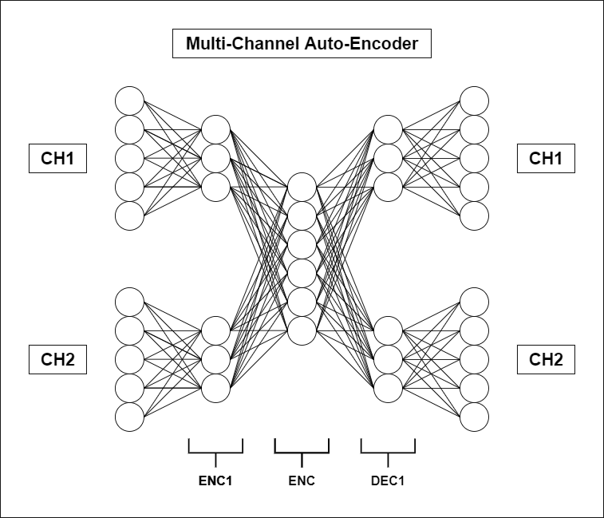
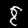
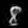

[![Contributors][contributors-shield]][contributors-url]
[![Forks][forks-shield]][forks-url]
[![Stargazers][stars-shield]][stars-url]
[![Issues][issues-shield]][issues-url]
[![MIT License][license-shield]][license-url]
[![LinkedIn][linkedin-shield]][linkedin-url]

<!-- PROJECT LOGO -->
<br />
<p align="center">
<h3 align="center">Multi-Channel Auto-Encoder for MNIST</h3>
<p align="center">

</p>




<!-- TABLE OF CONTENTS -->
<details open="open">
  <summary>Table of Contents</summary>
  <ol>
    <li>
      <a href="#about-the-project">About The Project</a>
    </li>
    <li>
      <a href="#getting-started">Getting Started</a>
      <ul>
        <li><a href="#prerequisites">Prerequisites</a></li>
        <li><a href="#installation">Installation</a></li>
      </ul>
    </li>
    <li><a href="#usage">Usage</a></li>
    <li><a href="#contributing">Contributing</a></li>
    <li><a href="#license">License</a></li>
    <li><a href="#contact">Contact</a></li>
    <li><a href="#acknowledgements">Acknowledgements</a></li>
  </ol>
</details>

<!-- ABOUT THE PROJECT -->

## About The Project

This project aims to create a multi-channel auto-encoder for MNIST dataset.


<!-- GETTING STARTED -->

## Getting Started

### Installation

1. Clone the repo

```shell
git clone https://github.com/DvdNss/mnist_encoder
```

2. Install requirements

```shell
pip install -r requirements.txt
```

3. Install PyTorch (GPU)

```shell
pip install torch==1.9.1+cu111 torchvision==0.10.1+cu111 -f https://download.pytorch.org/whl/torch_stable.html
```

<!-- USAGE EXAMPLES -->

## Usage

### Prerequisites

* CUDA and related tools (not necessary if you want to run with CPU)

### Example

1. Run the `train.py` script. Feel free to edit parameters like `channel sizes`, `epochs` or `learning rate`.
```python
import torch.nn
from torchvision.transforms import ToTensor

from model import Model

# Load data & dataloader
train_data, test_data, train_dataloader, test_dataloader = Model.load_mnist(transform=ToTensor(), batch_size=1)

# Load model
model = Model(device='cuda', img_chan_size=100, global_chan_size=50)
print(model.model)

# Loss & Optim
loss = torch.nn.MSELoss()
optimizer = torch.optim.Adam(model.model.parameters(), lr=1e-3)

epoch = 15
mask_prob = 25

# Training model
for _ in range(0, epoch):
    model.train(dataloader=train_dataloader, loss=loss, optimizer=optimizer, mask_prob=mask_prob, log_iter=60000)
    model.eval(dataloader=test_dataloader, loss=loss)
    model.eval(dataloader=test_dataloader, loss=loss, mask=True)
    mask_prob += 25 if mask_prob < 100 else 0
    print(f'Mask probability is now {mask_prob}%. ')

# Save model
model.save('model/model.pt')
```

2. Run the `inference.py` script (examples will be stored in example/ as .png)

```python
from torchvision.transforms import ToTensor

from model import Model

# Load data & dataloader
train_data, test_data, train_dataloader, test_dataloader = Model.load_mnist(transform=ToTensor(), batch_size=1)

# Load model
model = Model(load_model='model/model.pt', img_chan_size=100, global_chan_size=50)
print(f'Trainable parameters: {sum(p.numel() for p in model.model.parameters())}. ')

# Quick inference
model.infer(eval_data=test_data, random=True)
```

3. Examples of input/output/label

input :  \
output :  \
label : 8

<!-- CONTRIBUTING -->

## Contributing

Contributions are what make the open source community such an amazing place to learn, inspire, and create. Any
contributions you make are **greatly appreciated**.

1. Fork the Project
2. Create your Feature Branch (`git checkout -b feature/AmazingFeature`)
3. Commit your Changes (`git commit -m 'Add some AmazingFeature'`)
4. Push to the Branch (`git push origin feature/AmazingFeature`)
5. Open a Pull Request

<!-- LICENSE -->

## License

Distributed under the MIT License. See `LICENSE` for more information.


<!-- CONTACT -->

## Contact

David NAISSE - [@LinkedIn](https://www.linkedin.com/in/davidnaisse/) - private.david.naisse@gmail.com


<!-- ACKNOWLEDGEMENTS -->

## Acknowledgements

* None

<!-- MARKDOWN LINKS & IMAGES -->
<!-- https://www.markdownguide.org/basic-syntax/#reference-style-links -->

[contributors-shield]: https://img.shields.io/github/contributors/sunwaee/PROJECT_NAME.svg?style=for-the-badge

[contributors-url]: https://github.com/Sunwaee/PROJECT_NAME/graphs/contributors

[forks-shield]: https://img.shields.io/github/forks/sunwaee/PROJECT_NAME.svg?style=for-the-badge

[forks-url]: https://github.com/Sunwaee/PROJECT_NAME/network/members

[stars-shield]: https://img.shields.io/github/stars/sunwaee/PROJECT_NAME.svg?style=for-the-badge

[stars-url]: https://github.com/Sunwaee/PROJECT_NAME/stargazers

[issues-shield]: https://img.shields.io/github/issues/sunwaee/PROJECT_NAME.svg?style=for-the-badge

[issues-url]: https://github.com/Sunwaee/PROJECT_NAME/issues

[license-shield]: https://img.shields.io/github/license/sunwaee/PROJECT_NAME.svg?style=for-the-badge

[license-url]: https://github.com/Sunwaee/PROJECT_NAME/blob/master/LICENSE.txt

[linkedin-shield]: https://img.shields.io/badge/-LinkedIn-black.svg?style=for-the-badge&logo=linkedin&colorB=555

[linkedin-url]: https://www.linkedin.com/in/davidnaisse/